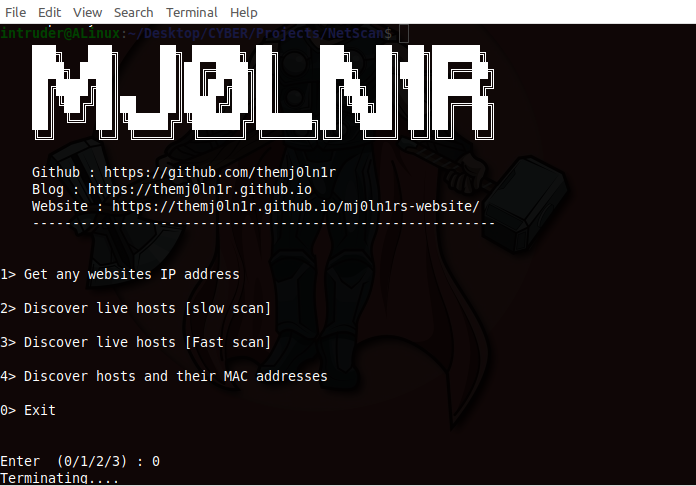

# NetScan

This is a basic computer networking based project the script i developed using python which can perform following tasks.

	1. Get any websites IP
	2. Discover live hosts
	3. Discover Hosts and MAC


I devoloped this script with less additional modules which can make the scan slow , but this can be executed in any system without any additional requirements.

### Requirements

You may require some python modules

	1. subprocess
	2. socket
	3. platform

These modules will be pre installed on every system, if not then install them with `pip3 or pip`
### Installation

```text 
git clone https://github.com/TheMj0ln1r/NetScan.git
cd NetScan
python3 NetScan.py
```



> If anything should be modified in the script please let me know.


##### Doveloped by Mj0ln1r
##### Website : https://themj0ln1r.github.io/mj0ln1rs-website/
##### Blog : https://themj0ln1r.github.io
